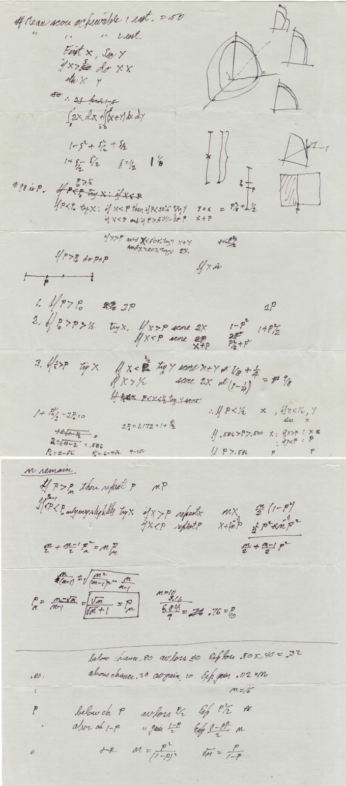

# Do Large Language Models Explore Like Humans? Evidence from Feynman's Restaurant Problem

> **Work in progress** — Code repository for an ongoing study on exploration–exploitation decision-making in LLMs.

---

## Background

### The Explore–Exploit Trade-off

A fundamental challenge in decision-making is balancing **exploration** (trying unknown options that might be better) against **exploitation** (committing to the best option found so far). This trade-off appears across diverse real-world contexts: choosing a restaurant, hiring candidates, selecting a parking spot, or deciding when to quit a job.

### Richard Feynman's Restaurant Problem

In the late 1970s, physicist Richard Feynman sat down for lunch at a Thai restaurant in Glendale, California with his friend Ralph Leighton. Leighton was debating whether to order his favorite dish or try something new. Feynman turned the dilemma into a math problem — and solved it.

<p align="center">
  
  <br>
  <em>Figure: Richard Feynman's original handwritten derivation of the restaurant problem.</em>
</p>

> *A visitor stays in a city for N nights and must dine at a restaurant each night. Each restaurant has a fixed but initially unknown quality score. The visitor can return to previously visited restaurants or try new ones. How should they decide each night in order to maximise the total cumulative score?*

Feynman's solution specifies a **decreasing threshold policy**: keep exploring until finding an option that exceeds a threshold $t_n$, then exploit. For Uniform quality scores, the optimal threshold with $n$ nights remaining is:

$$t_n = \frac{\sqrt{n}}{\sqrt{n} + 1}$$

Closed-form solutions exist for other distributions (Christian et al., 2026):

| Distribution | Optimal Threshold $t_n$ |
|---|---|
| Uniform | $\sqrt{n}/(\sqrt{n}+1)$ |
| Exponential | $1 + W[(n-1)/e]$ |
| Power Law | $\sqrt{n} + 1$ |
| Triangular | $2\sqrt{n/(n-1)}\cos(\pi/3 + \frac{1}{3}\arcsin(1/\sqrt{n}))$ |

where $W[\cdot]$ is the Lambert W function.

### The Reference Study

Christian, Russek, & Griffiths (2026) — published in *PNAS* — deciphered Feynman's notes, proved his solution optimal, generalised it to four distributions, and tested it against human behaviour in a preregistered experiment with **2,520 participants**.

**Key findings:**
- Humans do **not** follow the Feynman optimum.
- Humans use **linearly decreasing thresholds** — a simple heuristic nearly as effective as the optimum.
- Humans **over-explore early**, consistent with an early exploration bias.
- Threshold intercepts vary by distribution, suggesting humans are sensitive to the underlying reward structure.

> Christian, B., Russek, E. M., & Griffiths, T. L. (2026). Resolving Feynman's restaurant problem reveals optimal solutions and human strategies. *PNAS, 123*(23), e2509612123. https://doi.org/10.1073/pnas.2509612123

---

## This Study

### Research Question

> **Do Large Language Models solve Feynman's restaurant problem like humans, or like the mathematical optimum — and does persona conditioning shift their behaviour along the explore–exploit axis?**

```
Feynman Optimum  ←──────────────────────→  Human Behaviour
                           ↕
                     LLM Behaviour
                   (where does it fall?)
                           ↕
                   Persona Conditions
             (does it shift toward one end?)
```

### Persona Conditions

We use **domain persona prompting**: the LLM is assigned a professional identity drawn from the PersonaHub elite_persona dataset (Chan et al., 2024), filtered to a specific academic or professional domain. The persona text is prepended to the system prompt, following the standard approach in the LLM persona literature.

Domains are selected to span a theoretically motivated spectrum of expected explore–exploit tendencies:

| Condition | Domain | Predicted Bias | Rationale |
|---|---|---|---|
| `none` | — | Baseline | No persona |
| `law` | Law | ↓ Exploit | Rule-following, risk-averse |
| `finance` | Finance | ↓ Exploit | Conservative, return-maximising |
| `engineering` | Engineering | ↓ Exploit | Precision, reliability-focused |
| `mathematics` | Mathematics | ↓ Exploit | Formal optimisation orientation |
| `philosophy` | Philosophy | ↑ Explore | Inquiry-driven, open to alternatives |
| `history` | History | ↑ Explore | Broad contextual exploration |
| `sociology` | Sociology | ↑ Explore | Diversity of cases, pattern-seeking |
| `economics` | Economics | Neutral | Mixed risk/exploration framing |
| `computer science` | Computer Science | Neutral | Algorithmic but also exploratory |

> **Note**: Persona files must be downloaded before running domain persona conditions.  
> Run: `python src/download_personas.py`

**Persona source**: Chan, C., Wang, Z., Yu, J., Mi, F., Liu, L., Zhou, P., ... & Shang, L. (2024). PersonaHub: Personalized data creation at scale. *arXiv preprint arXiv:2406.20094.*

### Novel Contribution: Spatial Exploration Patterns

The original study did not record *which* grid cell participants clicked — only whether they explored or exploited. Because LLMs must explicitly state a coordinate in our design, we additionally capture **spatial exploration patterns**:

- Do LLMs scan systematically (e.g., row-by-row, column-by-column)?
- Do LLMs show corner, centre, or edge biases?
- Do persona conditions alter spatial strategies?

### Experimental Design

We replicate the reference study's experimental structure as closely as possible:

| Variable | Values |
|---|---|
| Score distribution | Uniform, Exponential, Power Law, Triangular |
| Total nights | 7, 14, 28 |
| Clamping condition | 0–6 (identical to Christian et al., 2026) |
| LLM provider | Anthropic, OpenAI, Google |
| Persona condition | `none` + 9 domain conditions |

**Key methodological decisions:**

1. **Same pre-exposure as human participants**: Each subject's 84-item pre-training grid from `FeynmanStudySamplesObserved.csv` is shown to the LLM exactly as it was shown to the original participant — as three 4×7 grids. The LLM infers the distribution from data, not from a label.

2. **Sequential (Method A)**: The experiment runs turn-by-turn. At each night, the LLM receives the updated grid and responds with a coordinate or `EXPLOIT`. This matches the sequential structure of the human task.

3. **Structured response format**: LLMs must respond in exactly one of two formats:
   - `EXPLORE (row,col)` — e.g. `EXPLORE (2,3)`
   - `EXPLOIT`

4. **Clamping invisible to the LLM**: Applied at the score-generation level; the LLM receives only the resulting score, identical to the information available to human participants.

---

## Repository Structure

```
feynman-llm-study/
│
├── README.md
├── requirements.txt
├── .env.example                      ← Copy to .env and add API keys
├── .gitignore
├── LICENSE
│
├── src/
│   ├── prompt_builder.py             ← Grid rendering, prompt generation, state management
│   ├── experiment.py                 ← Score generation, experiment loop, batch runner, CLI
│   ├── llm_client.py                 ← Multi-provider LLM client (Anthropic / OpenAI / Google)
│   ├── personas.py                   ← Persona conditions, loader, system prompt builder
│   ├── download_personas.py          ← Download PersonaHub personas to data/personas/
│   └── linear.py                     ← PMF utilities (adapted from Christian et al., 2026)
│
├── data/
│   ├── README.md                     ← Data download instructions
│   ├── FeynmanStudySamplesObserved.csv   ← Download from OSF (see data/README.md)
│   └── personas/                     ← PersonaHub JSONL files (after download_personas.py)
│       ├── economics.jsonl
│       ├── law.jsonl
│       └── ...
│
├── results/                          ← Experiment output CSVs (gitignored)
└── figures/                          ← Generated figures (planned)
```

---

## Quickstart

### 1. Clone and install

```bash
git clone [https://github.com/SeonGyuJang/Feynman-s-Restaurant-Problem.git]
cd Feynman-s-Restaurant-Problem
pip install -r requirements.txt
```

### 2. Set API keys

```bash
cp .env.example .env
# Set only the keys for providers you intend to use
export ANTHROPIC_API_KEY=your_key_here
export OPENAI_API_KEY=your_key_here
export GOOGLE_API_KEY=your_key_here
```

### 3. Download data

```bash
# Original study data (required)
# Download from: https://osf.io/download/q62ha/
# Place at: data/FeynmanStudySamplesObserved.csv

# PersonaHub personas (required for domain persona conditions)
pip install datasets
python src/download_personas.py --quota 500
```

### 4. Run experiment

**Baseline (no persona)**
```bash
# All 2,520 subjects — Anthropic
python src/experiment.py --provider anthropic --model claude-haiku-4-5-20251001

# All 2,520 subjects — OpenAI
python src/experiment.py --provider openai --model gpt-4o-mini

# All 2,520 subjects — Google
python src/experiment.py --provider google --model gemini-2.0-flash

# Quick test (first 10 subjects only)
python src/experiment.py --provider anthropic --max_subjects 10
```

**Domain persona conditions**
```bash
# Law persona (predicted exploit bias)
python src/experiment.py --provider anthropic --persona law

# Philosophy persona (predicted explore bias)
python src/experiment.py --provider anthropic --persona philosophy

# All conditions loop
for PERSONA in none law finance engineering mathematics philosophy history sociology economics "computer science"; do
    python src/experiment.py --provider anthropic --persona "$PERSONA"
done
```

**Python API**
```python
from src.experiment import run_batch

# Baseline
run_batch(
    samples_csv       = "data/FeynmanStudySamplesObserved.csv",
    provider          = "anthropic",
    model             = "claude-haiku-4-5-20251001",
    persona_condition = "none",
    output_csv        = "results/anthropic_haiku_none.csv",
)

# Domain persona
run_batch(
    samples_csv       = "data/FeynmanStudySamplesObserved.csv",
    provider          = "anthropic",
    persona_condition = "law",
    output_csv        = "results/anthropic_haiku_law.csv",
)
```

### 5. Supported models

| Provider | Default | Additional models |
|---|---|---|
| `anthropic` | `claude-haiku-4-5-20251001` | `claude-sonnet-4-6`, `claude-opus-4-6` |
| `openai` | `gpt-4o-mini` | `gpt-4o`, `gpt-4-turbo`, `gpt-3.5-turbo` |
| `google` | `gemini-2.0-flash` | `gemini-1.5-flash`, `gemini-1.5-pro` |

---

## Output Format

Results are saved as CSV files. Column structure matches Christian et al. (2026) with three additional columns:

| Column | Type | Description |
|---|---|---|
| `Subject` | int | Subject ID (matched to original human data) |
| `Total Nights` | int | 7 / 14 / 28 |
| `Night` | int | Night index (0-indexed) |
| `Nights Remaining` | int | Nights remaining after this decision |
| `Action` | str | `Explore` or `Exploit` |
| `Best Known` | float | Best score known before this decision |
| `Reward` | int | Score received this night |
| `Distribution` | str | Score distribution |
| `clamp` | int | Clamping condition (0–6) |
| `Position` | str | **(New)** Coordinate selected, e.g. `(2,3)` |
| `Persona` | str | **(New)** Persona condition (e.g. `none`, `law`) |
| `LLM Model` | str | **(New)** Provider/model, e.g. `anthropic/claude-haiku-4-5-20251001` |

---

## Analysis Plan

1. **Threshold extraction**: Fit a logistic model (Eq. 5 of Christian et al., 2026) to each LLM subject's sequence of Explore/Exploit decisions to recover the implied decision threshold at each night.

2. **Linear model comparison**: Test whether LLM thresholds decrease linearly with the proportion of nights remaining, as observed in humans.

3. **Three-way comparison**:

| Benchmark | Source |
|---|---|
| Feynman mathematical optimum | Christian et al. (2026), Eq. 1–4 |
| Human behaviour | Christian et al. (2026), N = 2,520 |
| LLM behaviour | This study |

4. **Cross-model comparison**: Compare threshold structure across Anthropic, OpenAI, and Google to assess generalisability.

5. **Persona effects (H4)**: Test whether domain persona conditions shift threshold intercepts in the predicted directions (exploit-biased domains → lower intercepts; explore-biased domains → higher intercepts).

6. **Spatial pattern analysis** *(novel)*: Analyse grid coordinate choices to detect systematic scanning strategies and spatial biases not measurable in the original human study.

---

## Hypotheses

**H1**: LLMs will show linearly decreasing thresholds similar to humans, rather than the nonlinear Feynman optimum.

**H2**: LLM threshold intercepts will vary by score distribution consistently with the Feynman optimum and human behaviour.

**H3**: LLMs will exhibit systematic spatial scanning patterns not present in human data.

**H4**: Domain persona conditions will shift LLM thresholds in directions consistent with each domain's risk orientation — exploit-biased domains (Law, Finance, Engineering, Mathematics) lowering thresholds; explore-biased domains (Philosophy, History, Sociology) raising them.

---

## Citation

```bibtex
@article{christian2026feynman,
  title   = {Resolving {Feynman's} Restaurant Problem Reveals Optimal Solutions and Human Strategies},
  author  = {Christian, Brian and Russek, Evan M. and Griffiths, Thomas L.},
  journal = {PNAS},
  volume  = {123},
  number  = {23},
  pages   = {e2509612123},
  year    = {2026},
  doi     = {10.1073/pnas.2509612123}
}

@article{chan2024personahub,
  title   = {{PersonaHub}: Personalized Data Creation at Scale},
  author  = {Chan, Cheng and Wang, Zheng and Yu, Jiani and Mi, Fei and Liu, Lifeng and Zhou, Peng and others},
  journal = {arXiv preprint arXiv:2406.20094},
  year    = {2024}
}
```

---

## License

MIT License. See [LICENSE](LICENSE) for details.  
`src/linear.py` is adapted from Christian et al. (2026) under MIT License.
